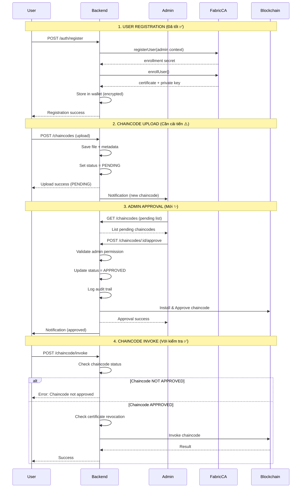

# ✔️ IBN v0.0.3 - Chaincode Approval System

**Multi-Party Approval Workflow**

---

## ⏸️ FUTURE FEATURE - Multi-Organization Required

> **Status:** Chaincode functions implemented but not testable  
> **Requirement:** Requires 2+ organizations for multi-party approval  
> **Current:** Single organization (IBNMSP) bootstrap  
> **Phase:** Phase 2 - after multi-org setup

---
**Status:** 📋 Proposed Enhancement  
**Priority:** High  
**Date:** 2025-12-24

---

## 🎯 Mục tiêu

Xây dựng hệ thống **Chaincode Approval Workflow** để đảm bảo:

1. **Kiểm soát chaincode** - Chỉ chaincode được approve mới có thể invoke/query
2. **Bảo mật đa lớp** - Admin phê duyệt trước khi chaincode hoạt động
3. **Audit trail** - Ghi nhận đầy đủ lịch sử upload, approve, reject
4. **RBAC integration** - Tích hợp với hệ thống phân quyền hiện có

---

## 📊 Phân tích hệ thống hiện tại

### ✅ **Điểm mạnh**

#### 1. **User Security Flow** (Đã tốt)
```
User Registration → Fabric CA Registration → Enrollment → Wallet Storage
                                                            ↓
                                                    Certificate Validation
                                                            ↓
                                                    Revocation Check
```

**Luồng hiện tại:**
- ✅ Sử dụng Fabric CA để register/enroll user
- ✅ Lưu trữ certificate an toàn trong wallet (encrypted)
- ✅ Kiểm tra certificate revocation trước mỗi invoke/query
- ✅ Extract certificate serial để tracking
- ✅ Admin context để register user mới

**Code implementation tốt:**
- `FabricCAService.registerUser()` - Dùng admin context
- `FabricCAService.enrollUser()` - Lấy certificate từ CA
- `FabricCAService.isCertificateRevoked()` - Check revocation
- `FabricGatewayService` - Validate certificate trước invoke/query

#### 2. **RBAC System** (Đã có sẵn)
- ✅ 54 permissions đã định nghĩa
- ✅ Có permission `chaincodes:approve` (line 71 trong seed)
- ✅ Admin role có quyền approve (line 73 trong role_permissions)

### ⚠️ **Điểm cần cải thiện**

#### 1. **Chaincode Approval Flow** (Chưa có)
```
❌ Hiện tại: User upload chaincode → Tự động có thể invoke/query
✅ Đề xuất: User upload → Admin approve → Mới có thể invoke/query
```

#### 2. **Chaincode Status Management** (Thiếu)
```sql
-- Bảng chaincodes hiện tại chỉ có:
is_installed BOOLEAN

-- Cần thêm:
status VARCHAR(20)  -- PENDING, APPROVED, REJECTED, DISABLED
approved_by UUID
approved_at TIMESTAMP
rejection_reason TEXT
```

#### 3. **Approval Workflow** (Chưa implement)
- ❌ Không có API endpoint để approve/reject
- ❌ Không có middleware kiểm tra chaincode status
- ❌ Không có notification cho user khi approved/rejected
- ❌ Không có audit log cho approval actions

---

## 🏗️ Kiến trúc đề xuất

### **Luồng hoàn chỉnh**



---

## 🗄️ Database Schema Changes

### **1. Cập nhật bảng `chaincodes`**

```sql
-- Thêm các cột mới
ALTER TABLE chaincodes 
ADD COLUMN status VARCHAR(20) DEFAULT 'PENDING',
ADD COLUMN approved_by UUID REFERENCES users(id),
ADD COLUMN approved_at TIMESTAMP,
ADD COLUMN rejected_by UUID REFERENCES users(id),
ADD COLUMN rejected_at TIMESTAMP,
ADD COLUMN rejection_reason TEXT,
ADD COLUMN file_path VARCHAR(500),
ADD COLUMN file_hash VARCHAR(64),
ADD COLUMN uploaded_by UUID REFERENCES users(id);

-- Thêm constraint
ALTER TABLE chaincodes
ADD CONSTRAINT chk_chaincode_status 
CHECK (status IN ('PENDING', 'APPROVED', 'REJECTED', 'DISABLED'));

-- Thêm index
CREATE INDEX idx_chaincodes_status ON chaincodes(status);
CREATE INDEX idx_chaincodes_approved_by ON chaincodes(approved_by);
```

### **2. Bảng `chaincode_approvals` (Audit trail)**

```sql
CREATE TABLE chaincode_approvals (
    id UUID PRIMARY KEY DEFAULT gen_random_uuid(),
    chaincode_id UUID NOT NULL REFERENCES chaincodes(id) ON DELETE CASCADE,
    action VARCHAR(20) NOT NULL, -- APPROVE, REJECT, DISABLE
    performed_by UUID NOT NULL REFERENCES users(id),
    reason TEXT,
    previous_status VARCHAR(20),
    new_status VARCHAR(20),
    created_at TIMESTAMP DEFAULT NOW(),
    
    CONSTRAINT chk_approval_action 
    CHECK (action IN ('APPROVE', 'REJECT', 'DISABLE', 'ENABLE'))
);

CREATE INDEX idx_chaincode_approvals_chaincode ON chaincode_approvals(chaincode_id);
CREATE INDEX idx_chaincode_approvals_performed_by ON chaincode_approvals(performed_by);
```

---

## 🔌 API Endpoints

### **1. Upload Chaincode** (Cập nhật)

```typescript
POST /api/v1/chaincodes/upload
Authorization: Bearer <token>
Content-Type: multipart/form-data

Body:
- file: <chaincode.tar.gz>
- name: string
- version: string
- channel_id: string
- language: string
- description: string

Response:
{
  "success": true,
  "data": {
    "id": "uuid",
    "name": "teatrace",
    "version": "0.0.3",
    "status": "PENDING",
    "uploaded_by": "user-id",
    "created_at": "2025-12-24T..."
  }
}
```

### **2. List Pending Chaincodes** (Mới)

```typescript
GET /api/v1/chaincodes/pending
Authorization: Bearer <admin-token>
Permission: chaincodes:approve

Response:
{
  "success": true,
  "data": [
    {
      "id": "uuid",
      "name": "teatrace",
      "version": "0.0.3",
      "status": "PENDING",
      "uploaded_by": {
        "id": "user-id",
        "username": "john"
      },
      "created_at": "2025-12-24T...",
      "file_path": "/uploads/chaincode-xxx.tar.gz",
      "file_hash": "sha256:..."
    }
  ]
}
```

### **3. Approve Chaincode** (Mới)

```typescript
POST /api/v1/chaincodes/:id/approve
Authorization: Bearer <admin-token>
Permission: chaincodes:approve

Body:
{
  "notes": "Approved after security review"
}

Response:
{
  "success": true,
  "data": {
    "id": "uuid",
    "status": "APPROVED",
    "approved_by": "admin-id",
    "approved_at": "2025-12-24T..."
  }
}
```

### **4. Reject Chaincode** (Mới)

```typescript
POST /api/v1/chaincodes/:id/reject
Authorization: Bearer <admin-token>
Permission: chaincodes:approve

Body:
{
  "reason": "Security vulnerabilities found"
}

Response:
{
  "success": true,
  "data": {
    "id": "uuid",
    "status": "REJECTED",
    "rejected_by": "admin-id",
    "rejected_at": "2025-12-24T...",
    "rejection_reason": "Security vulnerabilities found"
  }
}
```

### **5. Get Approval History** (Mới)

```typescript
GET /api/v1/chaincodes/:id/approvals
Authorization: Bearer <token>

Response:
{
  "success": true,
  "data": [
    {
      "action": "APPROVE",
      "performed_by": {
        "username": "admin"
      },
      "reason": "Approved after review",
      "previous_status": "PENDING",
      "new_status": "APPROVED",
      "created_at": "2025-12-24T..."
    }
  ]
}
```

---

## 🔧 Service Implementation

### **ChaincodeApprovalService.ts** (Mới)

```typescript
import { db } from '@config/knex';
import logger from '@core/logger';
import { NotFoundError, ForbiddenError } from '@core/errors';

export class ChaincodeApprovalService {
  /**
   * Approve chaincode
   */
  static async approveChaincode(
    chaincodeId: string,
    adminId: string,
    notes?: string
  ): Promise<void> {
    const trx = await db.transaction();
    
    try {
      // Get chaincode
      const chaincode = await trx('chaincodes')
        .where({ id: chaincodeId })
        .first();
      
      if (!chaincode) {
        throw new NotFoundError('Chaincode not found');
      }
      
      if (chaincode.status !== 'PENDING') {
        throw new ForbiddenError(
          `Cannot approve chaincode with status: ${chaincode.status}`
        );
      }
      
      // Update chaincode status
      await trx('chaincodes')
        .where({ id: chaincodeId })
        .update({
          status: 'APPROVED',
          approved_by: adminId,
          approved_at: new Date()
        });
      
      // Log approval
      await trx('chaincode_approvals').insert({
        chaincode_id: chaincodeId,
        action: 'APPROVE',
        performed_by: adminId,
        reason: notes,
        previous_status: 'PENDING',
        new_status: 'APPROVED'
      });
      
      await trx.commit();
      
      logger.info('Chaincode approved', {
        chaincodeId,
        adminId,
        name: chaincode.name
      });
      
      // TODO: Trigger notification to uploader
      // TODO: Install chaincode to Fabric network
    } catch (error) {
      await trx.rollback();
      throw error;
    }
  }
  
  /**
   * Reject chaincode
   */
  static async rejectChaincode(
    chaincodeId: string,
    adminId: string,
    reason: string
  ): Promise<void> {
    const trx = await db.transaction();
    
    try {
      const chaincode = await trx('chaincodes')
        .where({ id: chaincodeId })
        .first();
      
      if (!chaincode) {
        throw new NotFoundError('Chaincode not found');
      }
      
      if (chaincode.status !== 'PENDING') {
        throw new ForbiddenError(
          `Cannot reject chaincode with status: ${chaincode.status}`
        );
      }
      
      // Update chaincode status
      await trx('chaincodes')
        .where({ id: chaincodeId })
        .update({
          status: 'REJECTED',
          rejected_by: adminId,
          rejected_at: new Date(),
          rejection_reason: reason
        });
      
      // Log rejection
      await trx('chaincode_approvals').insert({
        chaincode_id: chaincodeId,
        action: 'REJECT',
        performed_by: adminId,
        reason,
        previous_status: 'PENDING',
        new_status: 'REJECTED'
      });
      
      await trx.commit();
      
      logger.info('Chaincode rejected', {
        chaincodeId,
        adminId,
        reason
      });
      
      // TODO: Notify uploader
    } catch (error) {
      await trx.rollback();
      throw error;
    }
  }
}
```

---

## 🛡️ Middleware: Check Chaincode Status

### **chaincodeStatusCheck.ts** (Mới)

```typescript
import { Request, Response, NextFunction } from 'express';
import { db } from '@config/knex';
import logger from '@core/logger';

/**
 * Middleware to check if chaincode is approved before invoke/query
 */
export const requireApprovedChaincode = async (
  req: Request,
  res: Response,
  next: NextFunction
) => {
  try {
    const { chaincode } = req.body;
    
    if (!chaincode) {
      return res.status(400).json({
        success: false,
        error: 'Chaincode name is required'
      });
    }
    
    // Get chaincode from database
    const chaincodeRecord = await db('chaincodes')
      .where({ name: chaincode })
      .first();
    
    if (!chaincodeRecord) {
      return res.status(404).json({
        success: false,
        error: `Chaincode not found: ${chaincode}`
      });
    }
    
    // Check if approved
    if (chaincodeRecord.status !== 'APPROVED') {
      logger.warn('Attempted to use unapproved chaincode', {
        chaincode,
        status: chaincodeRecord.status,
        userId: req.user?.id
      });
      
      return res.status(403).json({
        success: false,
        error: `Chaincode is not approved. Current status: ${chaincodeRecord.status}`,
        status: chaincodeRecord.status
      });
    }
    
    // Attach chaincode info to request
    req.chaincodeInfo = chaincodeRecord;
    
    next();
  } catch (error: any) {
    logger.error('Chaincode status check failed', {
      error: error.message
    });
    
    res.status(500).json({
      success: false,
      error: 'Failed to verify chaincode status'
    });
  }
};
```

### **Áp dụng middleware:**

```typescript
// routes/chaincode.ts
import { requireApprovedChaincode } from '@middleware/chaincodeStatusCheck';

router.post(
  '/chaincode/invoke',
  authMiddleware,
  requireApprovedChaincode, // ← Thêm middleware này
  async (req, res) => {
    // Invoke logic
  }
);

router.post(
  '/chaincode/query',
  authMiddleware,
  requireApprovedChaincode, // ← Thêm middleware này
  async (req, res) => {
    // Query logic
  }
);
```

---

## 📊 Đánh giá luồng bảo mật User hiện tại

### ✅ **Những điểm tốt**

1. **Certificate-based authentication**
   - Sử dụng Fabric CA để issue certificate
   - Certificate được lưu encrypted trong wallet
   - Mỗi invoke/query đều validate certificate

2. **Revocation check**
   - Kiểm tra certificate revocation trước mỗi operation
   - Database table `certificate_revocations` để tracking
   - Admin có thể revoke user certificate

3. **Admin context separation**
   - Admin identity riêng biệt để register user
   - Không expose admin secret
   - Proper User object creation từ wallet

4. **Audit logging**
   - Log tất cả chaincode invoke operations
   - Ghi nhận user_id, action, resource
   - Timestamp và transaction ID

### ⚠️ **Điểm cần cải thiện**

1. **Rate limiting** (Đã có trong v0.0.2 doc nhưng chưa áp dụng đầy đủ)
   - ✅ Đã có design trong `6-Security-Enhancements.md`
   - ❌ Cần verify implementation
   - ❌ Cần thêm rate limit cho chaincode invoke

2. **Brute-force protection**
   - ✅ Đã có design
   - ❌ Cần verify implementation

3. **Certificate expiry handling**
   - ✅ Có `validateCertificate()` check expiry
   - ⚠️ Chưa có auto-renewal mechanism
   - ⚠️ Chưa có notification trước khi expire

---

## 🚀 Implementation Plan

### **Phase 1: Database (1 day)**
- [ ] Tạo migration cho bảng `chaincodes` updates
- [ ] Tạo migration cho bảng `chaincode_approvals`
- [ ] Seed data test

### **Phase 2: Backend Services (2 days)**
- [ ] Implement `ChaincodeApprovalService`
- [ ] Implement middleware `requireApprovedChaincode`
- [ ] Update `ChaincodeService` để handle file upload
- [ ] Tạo API routes cho approval workflow

### **Phase 3: Integration (1 day)**
- [ ] Áp dụng middleware vào chaincode invoke/query routes
- [ ] Tích hợp với RBAC (check `chaincodes:approve` permission)
- [ ] Notification system (optional)

### **Phase 4: Frontend (2 days)**
- [ ] Admin page: Pending chaincodes list
- [ ] Admin page: Approve/Reject UI
- [ ] User page: Upload chaincode form
- [ ] User page: My chaincodes status

### **Phase 5: Testing (1 day)**
- [ ] Unit tests cho approval service
- [ ] Integration tests cho workflow
- [ ] E2E test: Upload → Approve → Invoke

**Total: 7 days**

---

## ✅ Success Criteria

- ✅ User không thể invoke/query chaincode chưa được approve
- ✅ Chỉ admin có quyền approve/reject chaincode
- ✅ Mọi approval action đều được audit log
- ✅ User nhận notification khi chaincode được approve/reject
- ✅ Certificate revocation check hoạt động trước mỗi invoke
- ✅ Rate limiting áp dụng cho chaincode operations

---

**Next:** [Implementation Guide](./12-Chaincode-Approval-Implementation.md)
